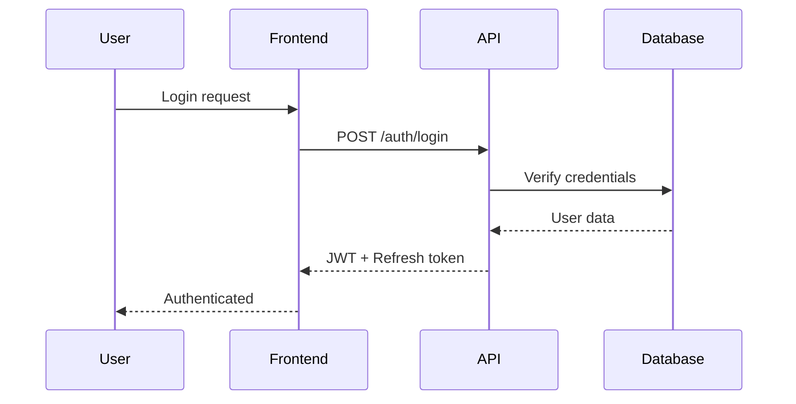

# OpenStrand Architecture

## System Overview

OpenStrand follows a modern three-tier architecture with clear separation of concerns:

```
ΓöîΓöÇΓöÇΓöÇΓöÇΓöÇΓöÇΓöÇΓöÇΓöÇΓöÇΓöÇΓöÇΓöÇΓöÇΓöÇΓöÇΓöÇΓöÇΓöÇΓöÇΓöÇΓöÇΓöÇΓöÇΓöÇΓöÇΓöÇΓöÇΓöÇΓöÇΓöÇΓöÇΓöÇΓöÇΓöÇΓöÇΓöÇΓöÇΓöÇΓöÇΓöÇΓöÇΓöÇΓöÇΓöÇΓöÇΓöÇΓöÇΓöÇΓöÇΓöÇΓöÇΓöÇΓöÇΓöÇΓöÇΓöÇΓöÉ
Γöé                    Client Layer                         Γöé
Γöé  ΓöîΓöÇΓöÇΓöÇΓöÇΓöÇΓöÇΓöÇΓöÇΓöÇΓöÇΓöÇΓöÇΓöÇΓöÉ  ΓöîΓöÇΓöÇΓöÇΓöÇΓöÇΓöÇΓöÇΓöÇΓöÇΓöÇΓöÇΓöÇΓöÇΓöÉ  ΓöîΓöÇΓöÇΓöÇΓöÇΓöÇΓöÇΓöÇΓöÇΓöÇΓöÇΓöÇΓöÇΓöÇΓöÉ    Γöé
Γöé  Γöé   Web App   Γöé  Γöé Mobile App  Γöé  Γöé   CLI/SDK   Γöé    Γöé
Γöé  Γöé  (Next.js)  Γöé  Γöé (Capacitor) Γöé  Γöé (TypeScript)Γöé    Γöé
Γöé  ΓööΓöÇΓöÇΓöÇΓöÇΓöÇΓöÇΓöÇΓöÇΓöÇΓöÇΓöÇΓöÇΓöÇΓöÿ  ΓööΓöÇΓöÇΓöÇΓöÇΓöÇΓöÇΓöÇΓöÇΓöÇΓöÇΓöÇΓöÇΓöÇΓöÿ  ΓööΓöÇΓöÇΓöÇΓöÇΓöÇΓöÇΓöÇΓöÇΓöÇΓöÇΓöÇΓöÇΓöÇΓöÿ    Γöé
ΓööΓöÇΓöÇΓöÇΓöÇΓöÇΓöÇΓöÇΓöÇΓöÇΓöÇΓöÇΓöÇΓöÇΓöÇΓöÇΓöÇΓöÇΓöÇΓöÇΓöÇΓöÇΓöÇΓöÇΓöÇΓöÇΓöÇΓöÇΓöÇΓöÇΓöÇΓöÇΓöÇΓöÇΓöÇΓöÇΓöÇΓöÇΓöÇΓöÇΓöÇΓöÇΓöÇΓöÇΓöÇΓöÇΓöÇΓöÇΓöÇΓöÇΓöÇΓöÇΓöÇΓöÇΓöÇΓöÇΓöÇΓöÇΓöÿ
                            Γöé
                            Γû╝
ΓöîΓöÇΓöÇΓöÇΓöÇΓöÇΓöÇΓöÇΓöÇΓöÇΓöÇΓöÇΓöÇΓöÇΓöÇΓöÇΓöÇΓöÇΓöÇΓöÇΓöÇΓöÇΓöÇΓöÇΓöÇΓöÇΓöÇΓöÇΓöÇΓöÇΓöÇΓöÇΓöÇΓöÇΓöÇΓöÇΓöÇΓöÇΓöÇΓöÇΓöÇΓöÇΓöÇΓöÇΓöÇΓöÇΓöÇΓöÇΓöÇΓöÇΓöÇΓöÇΓöÇΓöÇΓöÇΓöÇΓöÇΓöÇΓöÉ
Γöé                     API Layer                           Γöé
Γöé  ΓöîΓöÇΓöÇΓöÇΓöÇΓöÇΓöÇΓöÇΓöÇΓöÇΓöÇΓöÇΓöÇΓöÇΓöÇΓöÇΓöÇΓöÇΓöÇΓöÇΓöÇΓöÇΓöÇΓöÇΓöÇΓöÇΓöÇΓöÇΓöÇΓöÇΓöÇΓöÇΓöÇΓöÇΓöÇΓöÇΓöÇΓöÇΓöÇΓöÇΓöÇΓöÇΓöÇΓöÇΓöÇΓöÇΓöÇΓöÇΓöÇΓöÇΓöÉ   Γöé
Γöé  Γöé            Fastify REST API                      Γöé   Γöé
Γöé  Γöé  ΓöîΓöÇΓöÇΓöÇΓöÇΓöÇΓöÇΓöÇΓöÇΓöÇΓöÇΓöÉ ΓöîΓöÇΓöÇΓöÇΓöÇΓöÇΓöÇΓöÇΓöÇΓöÇΓöÇΓöÉ ΓöîΓöÇΓöÇΓöÇΓöÇΓöÇΓöÇΓöÇΓöÇΓöÇΓöÇΓöÉ       Γöé   Γöé
Γöé  Γöé  Γöé  Auth    Γöé Γöé  Strands Γöé Γöé   AI     Γöé       Γöé   Γöé
Γöé  Γöé  Γöé  Service Γöé Γöé  Service Γöé Γöé Service  Γöé       Γöé   Γöé
Γöé  Γöé  ΓööΓöÇΓöÇΓöÇΓöÇΓöÇΓöÇΓöÇΓöÇΓöÇΓöÇΓöÿ ΓööΓöÇΓöÇΓöÇΓöÇΓöÇΓöÇΓöÇΓöÇΓöÇΓöÇΓöÿ ΓööΓöÇΓöÇΓöÇΓöÇΓöÇΓöÇΓöÇΓöÇΓöÇΓöÇΓöÿ       Γöé   Γöé
Γöé  ΓööΓöÇΓöÇΓöÇΓöÇΓöÇΓöÇΓöÇΓöÇΓöÇΓöÇΓöÇΓöÇΓöÇΓöÇΓöÇΓöÇΓöÇΓöÇΓöÇΓöÇΓöÇΓöÇΓöÇΓöÇΓöÇΓöÇΓöÇΓöÇΓöÇΓöÇΓöÇΓöÇΓöÇΓöÇΓöÇΓöÇΓöÇΓöÇΓöÇΓöÇΓöÇΓöÇΓöÇΓöÇΓöÇΓöÇΓöÇΓöÇΓöÇΓöÿ   Γöé
ΓööΓöÇΓöÇΓöÇΓöÇΓöÇΓöÇΓöÇΓöÇΓöÇΓöÇΓöÇΓöÇΓöÇΓöÇΓöÇΓöÇΓöÇΓöÇΓöÇΓöÇΓöÇΓöÇΓöÇΓöÇΓöÇΓöÇΓöÇΓöÇΓöÇΓöÇΓöÇΓöÇΓöÇΓöÇΓöÇΓöÇΓöÇΓöÇΓöÇΓöÇΓöÇΓöÇΓöÇΓöÇΓöÇΓöÇΓöÇΓöÇΓöÇΓöÇΓöÇΓöÇΓöÇΓöÇΓöÇΓöÇΓöÇΓöÿ
                            Γöé
                            Γû╝
ΓöîΓöÇΓöÇΓöÇΓöÇΓöÇΓöÇΓöÇΓöÇΓöÇΓöÇΓöÇΓöÇΓöÇΓöÇΓöÇΓöÇΓöÇΓöÇΓöÇΓöÇΓöÇΓöÇΓöÇΓöÇΓöÇΓöÇΓöÇΓöÇΓöÇΓöÇΓöÇΓöÇΓöÇΓöÇΓöÇΓöÇΓöÇΓöÇΓöÇΓöÇΓöÇΓöÇΓöÇΓöÇΓöÇΓöÇΓöÇΓöÇΓöÇΓöÇΓöÇΓöÇΓöÇΓöÇΓöÇΓöÇΓöÇΓöÉ
Γöé                    Data Layer                           Γöé
Γöé  ΓöîΓöÇΓöÇΓöÇΓöÇΓöÇΓöÇΓöÇΓöÇΓöÇΓöÇΓöÉ  ΓöîΓöÇΓöÇΓöÇΓöÇΓöÇΓöÇΓöÇΓöÇΓöÇΓöÇΓöÉ  ΓöîΓöÇΓöÇΓöÇΓöÇΓöÇΓöÇΓöÇΓöÇΓöÇΓöÇΓöÉ            Γöé
Γöé  ΓöéPostgreSQLΓöé  Γöé  Redis   Γöé  Γöé    S3    Γöé            Γöé
Γöé  Γöé (Primary)Γöé  Γöé  (Cache) Γöé  Γöé (Files)  Γöé            Γöé
Γöé  ΓööΓöÇΓöÇΓöÇΓöÇΓöÇΓöÇΓöÇΓöÇΓöÇΓöÇΓöÿ  ΓööΓöÇΓöÇΓöÇΓöÇΓöÇΓöÇΓöÇΓöÇΓöÇΓöÇΓöÿ  ΓööΓöÇΓöÇΓöÇΓöÇΓöÇΓöÇΓöÇΓöÇΓöÇΓöÇΓöÿ            Γöé
ΓööΓöÇΓöÇΓöÇΓöÇΓöÇΓöÇΓöÇΓöÇΓöÇΓöÇΓöÇΓöÇΓöÇΓöÇΓöÇΓöÇΓöÇΓöÇΓöÇΓöÇΓöÇΓöÇΓöÇΓöÇΓöÇΓöÇΓöÇΓöÇΓöÇΓöÇΓöÇΓöÇΓöÇΓöÇΓöÇΓöÇΓöÇΓöÇΓöÇΓöÇΓöÇΓöÇΓöÇΓöÇΓöÇΓöÇΓöÇΓöÇΓöÇΓöÇΓöÇΓöÇΓöÇΓöÇΓöÇΓöÇΓöÇΓöÿ
```

## Core Components

### 1. Frontend Application (`openstrand-app`)

**Technology Stack:**
- Next.js 14 with App Router
- TypeScript for type safety
- Tailwind CSS for styling
- Zustand for state management
- TanStack Query for data fetching

**Key Features:**
- Server-side rendering for SEO
- Incremental static regeneration
- Optimistic UI updates
- Real-time collaboration via WebSockets

### 2. Backend API (`@openstrand/teams-backend`)

**Technology Stack:**
- Fastify for high-performance HTTP
- Prisma ORM for database access
- BullMQ for job queues
- Socket.io for real-time features

**Service Architecture:**
```typescript
// Service layer pattern
class StrandService {
  async create(data: CreateStrandDto): Promise<Strand> {
    // Validation
    const validated = await this.validate(data);
    
    // Business logic
    const strand = await this.prisma.strand.create({
      data: validated
    });
    
    // Side effects
    await this.indexForSearch(strand);
    await this.extractMetadata(strand);
    
    return strand;
  }
}
```

### 3. SDK (`@openstrand/sdk`)

**Design Principles:**
- Isomorphic (works in Node.js and browsers)
- Fully typed with TypeScript
- Retry logic with exponential backoff
- Request/response interceptors

**Usage Example:**
```typescript
const client = new OpenStrandClient({
  apiUrl: 'https://api.openstrand.com',
  token: 'your-api-token'
});

// Automatic retry and error handling
const strands = await client.strands.list({
  limit: 10,
  tags: ['important']
});
```

## Data Models

### Core Entities

```prisma
model Strand {
  id          String   @id @default(cuid())
  title       String
  content     Json
  tags        Tag[]
  connections Weave[]
  createdAt   DateTime @default(now())
  updatedAt   DateTime @updatedAt
  
  // Relations
  author      User     @relation(fields: [authorId], references: [id])
  authorId    String
  workspace   Workspace @relation(fields: [workspaceId], references: [id])
  workspaceId String
  
  @@index([authorId, createdAt])
  @@index([workspaceId, updatedAt])
}

model Weave {
  id       String @id @default(cuid())
  from     Strand @relation("WeaveFrom", fields: [fromId], references: [id])
  fromId   String
  to       Strand @relation("WeaveTo", fields: [toId], references: [id])
  toId     String
  strength Float  @default(1.0)
  
  @@unique([fromId, toId])
  @@index([strength])
}
```

## Security Architecture

### Authentication Flow



### Authorization

- **Role-Based Access Control (RBAC)** for workspace permissions
- **Attribute-Based Access Control (ABAC)** for fine-grained strand access
- **API Key authentication** for SDK/integrations

## Performance Optimizations

### 1. Caching Strategy

```typescript
// Multi-layer caching
class CacheService {
  async get(key: string) {
    // L1: In-memory cache
    const memory = this.memoryCache.get(key);
    if (memory) return memory;
    
    // L2: Redis cache
    const redis = await this.redis.get(key);
    if (redis) {
      this.memoryCache.set(key, redis);
      return redis;
    }
    
    // L3: Database
    const data = await this.fetchFromDb(key);
    await this.warmCache(key, data);
    return data;
  }
}
```

### 2. Database Optimization

- **Connection pooling** with PgBouncer
- **Read replicas** for analytics queries
- **Materialized views** for complex aggregations
- **Partial indexes** for common query patterns

### 3. Asset Optimization

- **Image optimization** with Next.js Image component
- **Code splitting** per route
- **CDN distribution** for static assets
- **Brotli compression** for API responses

## Deployment Architecture

### Production Setup

```yaml
# docker-compose.yml
services:
  app:
    image: framersai/openstrand-app
    environment:
      - API_URL=http://api:8000
    ports:
      - "3000:3000"
  
  api:
    image: framersai/openstrand-api
    environment:
      - DATABASE_URL=postgresql://...
      - REDIS_URL=redis://redis:6379
    ports:
      - "8000:8000"
  
  postgres:
    image: postgres:16-alpine
    volumes:
      - postgres_data:/var/lib/postgresql/data
  
  redis:
    image: redis:7-alpine
    volumes:
      - redis_data:/data
```

### Scaling Considerations

1. **Horizontal scaling** via Kubernetes
2. **Database sharding** by workspace_id
3. **Queue workers** for background jobs
4. **WebSocket clustering** with Redis adapter

## Monitoring & Observability

### Metrics Collection

- **Application metrics** via Prometheus
- **Tracing** with OpenTelemetry
- **Logging** aggregated in Elasticsearch
- **Error tracking** via Sentry

### Health Checks

```typescript
// Health check endpoint
app.get('/health', async (request, reply) => {
  const checks = await Promise.allSettled([
    checkDatabase(),
    checkRedis(),
    checkS3(),
  ]);
  
  const healthy = checks.every(c => c.status === 'fulfilled');
  
  reply.code(healthy ? 200 : 503).send({
    status: healthy ? 'healthy' : 'degraded',
    checks: formatChecks(checks),
    timestamp: new Date().toISOString()
  });
});
```

## Development Workflow

### Local Development

```bash
# Start all services
docker-compose up -d postgres redis
npm run dev

# Run tests
npm test

# Type checking
npm run type-check

# Database migrations
npm run prisma:migrate
```

### CI/CD Pipeline

1. **Pull Request** → Run tests, type check, lint
2. **Merge to main** → Build Docker images
3. **Tag release** → Deploy to staging
4. **Manual approval** → Deploy to production

---

For implementation details, see the [source code](https://github.com/framersai/openstrand-monorepo).
