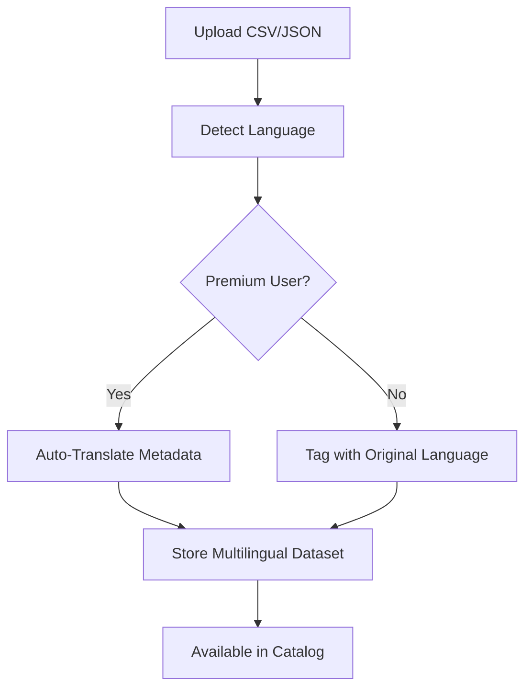

# Internationalization (i18n) System Guide

## Table of Contents

1. [Overview](#overview)
2. [Supported Languages](#supported-languages)
3. [Architecture](#architecture)
4. [Language-Aware Datasets](#language-aware-datasets)
5. [Multilingual Visualizations](#multilingual-visualizations)
6. [Implementation Details](#implementation-details)
7. [User Experience](#user-experience)
8. [Developer Guide](#developer-guide)
9. [API Reference](#api-reference)

---

## Overview

OpenStrand/OpenStrand features a comprehensive internationalization system that supports 10+ languages with full dataset and visualization localization. The system provides:

- **UI Translation**: Complete interface translation in 10 languages
- **Dataset Localization**: Language tagging and translation for datasets
- **Smart LLM Adaptation**: Language-aware AI responses
- **RTL Support**: Full right-to-left language support (Arabic, Hebrew)
- **Column Translation**: Original and translated column names

### Current implementation snapshot (Oct 2025)

- The Next.js App Router is fully locale-scoped: every route lives beneath `src/app/[locale]/` and the root layout simply delegates to `NextIntlClientProvider` within the nested layout.
- `src/middleware.ts` is active again so unauthenticated `/` traffic is rewritten to the detected locale and a `locale` cookie is maintained.
- `src/i18n/messages.ts` aggregates the `common`, `datasets`, `visualizations`, `settings`, `auth`, `billing`, and `errors` namespaces with graceful fallbacks back to English.
- Backend uploads, catalog loads, and app-state loaders now populate `DatasetMetadata.language`, `available_languages`, and `translations` fields using `backend/services/language.py` for detection.
- Frontend links call `useLocalizedPath` / `buildLocalePath` so language context is preserved when navigating between pages or deep-linking into product sections.

---

## Supported Languages

| Language | Code | Native Name | Status | RTL | Default Currency |
|----------|------|-------------|--------|-----|------------------|
| English (International) | `en` | English | Yes Base | No | USD |
| Chinese Simplified | `zh-CN` | 简体中文 | Yes Complete | No | CNY |
| Spanish | `es` | Español | Yes Complete | No | EUR |
| Hindi | `hi` | हिन्दी | Yes Complete | No | INR |
| Arabic | `ar` | العربية | Yes Complete | Yes | SAR |
| Japanese | `ja` | 日本語 | Yes Complete | No | JPY |
| Korean | `ko` | 한국어 | Yes Complete | No | KRW |
| Portuguese | `pt` | Português | Yes Complete | No | BRL |
| Russian | `ru` | Русский | Yes Complete | No | RUB |
| French | `fr` | Français | Yes Complete | No | EUR |

---

## Architecture

### System Components

```
┌─────────────────────────────────────────────────────┐
│                    User Interface                    │
│  ┌────────────┐  ┌──────────────┐  ┌────────────┐  │
│  │  Language  │  │   Localized  │  │   Dataset  │  │
│  │  Switcher  │  │   Content    │  │   Badges   │  │
│  └────────────┘  └──────────────┘  └────────────┘  │
└─────────────────────────────────────────────────────┘
                            │
┌─────────────────────────────────────────────────────┐
│                 next-intl Framework                  │
│  ┌────────────┐  ┌──────────────┐  ┌────────────┐  │
│  │   Locale   │  │  Translation │  │   Format   │  │
│  │  Detection │  │    Engine    │  │   System   │  │
│  └────────────┘  └──────────────┘  └────────────┘  │
└─────────────────────────────────────────────────────┘
                            │
┌─────────────────────────────────────────────────────┐
│              Dataset Language System                 │
│  ┌────────────┐  ┌──────────────┐  ┌────────────┐  │
│  │  Language  │  │  Translation │  │   Column   │  │
│  │  Detection │  │   Service    │  │   Mapping  │  │
│  └────────────┘  └──────────────┘  └────────────┘  │
└─────────────────────────────────────────────────────┘
                            │
┌─────────────────────────────────────────────────────┐
│                    Data Layer                        │
│  ┌────────────┐  ┌──────────────┐  ┌────────────┐  │
│  │  Original  │  │  Translated  │  │  Language  │  │
│  │    Data    │  │    Metadata  │  │    Tags    │  │
│  └────────────┘  └──────────────┘  └────────────┘  │
└─────────────────────────────────────────────────────┘
```

### File Structure

```
frontend/
├── src/
│   ├── i18n/
│   │   ├── config.ts              # Language configuration
│   │   ├── locales/               # Translation files
│   │   │   ├── en/               # English (base)
│   │   │   ├── zh-CN/            # Chinese
│   │   │   ├── es/               # Spanish
│   │   │   ├── ar/               # Arabic
│   │   │   └── .../              # Other languages
│   │   └── middleware.ts          # Locale routing
│   ├── app/
│   │   └── [locale]/              # Locale-based routing
│   └── components/
│       └── language-switcher.tsx  # Language UI
```

---

## Language-Aware Datasets

### Dataset Language Schema

Each dataset contains language metadata:

```typescript
interface Dataset {
  id: string;
  name: string;

  // Language fields
  language: string;              // Primary language (ISO code)
  languages_available: string[]; // Available translations

  // Metadata translations
  metadata: {
    [locale: string]: {
      name: string;
      description: string;
      tags: string[];
    }
  };

  // Column translations
  columns: {
    original_name: string;
    type: string;
    translations: {
      [locale: string]: {
        name: string;
        description?: string;
      }
    }
  }[];
}
```

### Language Detection

When a dataset is uploaded, the system:

1. **Analyzes content** to detect primary language
2. **Tags dataset** with detected language
3. **Offers translation** (Premium feature)
4. **Maintains original** column names alongside translations

### Dataset Upload Flow



### Translation Features by Plan

| Feature | Free | Basic | Pro | Enterprise |
|---------|------|-------|-----|------------|
| Upload in any language | Yes | Yes | Yes | Yes |
| Language detection | Yes | Yes | Yes | Yes |
| English datasets visible | Yes | Yes | Yes | Yes |
| Browse by language | No | Yes | Yes | Yes |
| Auto-translate metadata | No | No | Yes | Yes |
| Column name translation | No | No | Yes | Yes |
| Multi-language export | No | No | No | Yes |

---

## Multilingual Visualizations

### Visualization Language Matching

Visualizations maintain 1:1 language matching with their datasets:

```typescript
interface Visualization {
  id: string;
  dataset_id: string;

  // Language matching
  language: string;        // Inherits from dataset
  ui_language: string;     // Language used for creation

  // Multilingual content
  title: {
    [locale: string]: string;
  };

  labels: {
    [locale: string]: {
      xAxis?: string;
      yAxis?: string;
      legend?: string[];
    }
  };

  // LLM prompt in original language
  prompt: string;
  prompt_language: string;
}
```

### LLM Language Adaptation

The system adapts LLM interactions based on:

1. **Dataset Language**: Column names in original language
2. **UI Language**: Interface and responses
3. **Prompt Language**: Auto-detected from user input

Example flow:
```
User (UI: Spanish) -> Dataset (Chinese) -> LLM
- Prompt: Spanish
- Column refs: Chinese (original) + Spanish (translated)
- Response: Spanish
- Chart labels: Spanish (with Chinese option)
```

---

## Implementation Details

### Language Detection Algorithm

```typescript
function detectDatasetLanguage(data: any[]): string {
  // 1. Check column names
  const columnLanguage = detectLanguageFromColumns(Object.keys(data[0]));

  // 2. Sample content from string columns
  const contentLanguage = detectLanguageFromContent(data.slice(0, 100));

  // 3. Check for specific character sets
  const charset = detectCharacterSet(JSON.stringify(data));

  // 4. Weighted decision
  return weightedLanguageDecision({
    columns: columnLanguage,
    content: contentLanguage,
    charset: charset
  });
}
```

### Column Name Translation

Original names are preserved with translations:

```json
{
  "columns": [
    {
      "original_name": "年收入",
      "type": "number",
      "translations": {
        "en": {
          "name": "Annual Revenue",
          "description": "Company annual revenue"
        },
        "es": {
          "name": "Ingresos Anuales",
          "description": "Ingresos anuales de la empresa"
        }
      }
    }
  ]
}
```

### Language-Aware Browsing

The catalog filters by language with smart defaults:

```typescript
function getDatasetFilters(userLocale: string) {
  return {
    // Primary filter
    primary: userLocale,

    // Secondary filters
    secondary: [
      'en',  // Always include English (international)
      ...getRelatedLanguages(userLocale)
    ],

    // Show all option
    showAll: userLocale !== 'en'
  };
}
```

---

## User Experience

### Language Badges

Datasets and visualizations display language badges:

```tsx
<LanguageBadge
  language="zh-CN"
  showFlag={true}
  variant="compact"  // compact | full
/>
```

Badge variations:
- **English**: No badge or minimal "INT" label
- **Other languages**: Flag + code (e.g., 🇨🇳 ZH)
- **Multi-language**: Stack of flags

### Language Switching Flow

1. User changes UI language
2. Page reloads with new locale
3. Datasets filtered to new language
4. English datasets always visible as "International"
5. Visualizations adapt labels

### Smart Defaults

- **English users**: See all content, no language badges for English
- **Non-English users**: See localized content first, then English
- **Premium users**: Get translation options
- **Free users**: See original language only

---

## Developer Guide

### Adding a New Language

1. **Add to config** (`src/i18n/config.ts`):
```typescript
export const locales = [...existing, 'de'] as const;

export const languageMetadata = {
  ...existing,
  'de': {
    name: 'German',
    nativeName: 'Deutsch',
    direction: 'ltr',
    flag: '🇩🇪',
  }
};
```

2. **Create translation files**:
```bash
mkdir frontend/src/i18n/locales/de
cp -r frontend/src/i18n/locales/en/* frontend/src/i18n/locales/de/
# Then translate the JSON files
```

3. **Update dataset language detection** to recognize the new language

### API Endpoints

#### Get datasets by language
```http
GET /api/datasets?language=zh-CN
GET /api/datasets?language=en&include_international=true
```

#### Upload with language
```http
POST /api/datasets/upload
{
  "file": File,
  "language": "auto" | "zh-CN" | "en" | ...,
  "translate": boolean  // Premium only
}
```

#### Get translations
```http
GET /api/datasets/{id}/translations
{
  "columns": {...},
  "metadata": {...}
}
```

#### Update translations
```http
PUT /api/datasets/{id}/translations
{
  "locale": "es",
  "columns": {...},
  "metadata": {...}
}
```

---

## Database Schema Updates

### Datasets Table
```sql
ALTER TABLE datasets ADD COLUMN language VARCHAR(10) DEFAULT 'en';
ALTER TABLE datasets ADD COLUMN languages_available TEXT[]; -- Array of ISO codes
ALTER TABLE datasets ADD COLUMN translations JSONB; -- Metadata translations
ALTER TABLE datasets ADD COLUMN column_translations JSONB; -- Column name mappings

-- Index for language filtering
CREATE INDEX idx_datasets_language ON datasets(language);
CREATE INDEX idx_datasets_languages_available ON datasets USING GIN(languages_available);
```

### Visualizations Table
```sql
ALTER TABLE visualizations ADD COLUMN language VARCHAR(10);
ALTER TABLE visualizations ADD COLUMN ui_language VARCHAR(10);
ALTER TABLE visualizations ADD COLUMN label_translations JSONB;

-- Index for language matching
CREATE INDEX idx_visualizations_language ON visualizations(language);
```

---

## Best Practices

### For Users

1. **Upload in native language**: Better accuracy and context
2. **Add descriptions**: Help others understand your data
3. **Use consistent language**: In prompts for better results
4. **Tag appropriately**: Helps discovery

### For Developers

1. **Preserve originals**: Never overwrite original data
2. **Cache translations**: Reduce API calls
3. **Handle RTL**: Test with Arabic/Hebrew
4. **Validate languages**: Use ISO 639-1 codes
5. **Graceful fallbacks**: Default to English when needed

---

## Troubleshooting

### Common Issues

| Issue | Solution |
|-------|----------|
| Language not detected | Manually specify in upload |
| Translations missing | Check plan limits |
| RTL layout broken | Ensure `dir="rtl"` is set |
| Columns not translating | Verify Premium plan active |
| Wrong language shown | Clear cookies, check settings |

### Language Priority

1. User-selected language (cookie)
2. Browser language (Accept-Language)
3. Dataset original language
4. English (fallback)

---

## Future Enhancements

- [ ] Auto-translation for Free tier (limited)
- [ ] Voice input in native languages
- [ ] Language-specific chart styles
- [ ] Regional format preferences
- [ ] Collaborative translation system
- [ ] Language learning mode
- [ ] Cross-language search

---

## Support

For language-related issues or translation contributions:
- GitHub Issues: [Report Issue](https://github.com/yourrepo/issues)
- Email: translations@frame.dev
- Documentation: This guide


---

## Appendices

### Appendix A: Implementation Plan (Consolidated)

# Comprehensive i18n Implementation Plan for OpenStrand/OpenStrand

## Executive Summary

This document outlines a complete internationalization (i18n) implementation strategy for OpenStrand/OpenStrand, supporting 10+ languages including Chinese, Korean, Arabic, Japanese, and other major world languages. The implementation will use **next-intl** for Next.js 14 App Router compatibility.

---

## Table of Contents

1. Language Strategy
2. Technical Architecture
3. Implementation Phases
4. Translation Management
5. Performance Optimization
6. Quality Assurance
7. Maintenance Strategy

---

## Language Strategy

### Target Languages (Phase 1 - Priority Markets)

| Language | Code | Native Name | Speakers | Direction | Market Priority | Script |
|----------|------|-------------|----------|-----------|-----------------|--------|
| English | en | English | 1.5B | LTR | Base | Latin |
| Chinese (Simplified) | zh-CN | 简体中文 | 1.1B | LTR | Critical | Chinese |
| Spanish | es | Español | 559M | LTR | High | Latin |
| Hindi | hi | हिन्दी | 602M | LTR | High | Devanagari |
| Arabic | ar | العربية | 422M | RTL | High | Arabic |
| Japanese | ja | 日本語 | 125M | LTR | High | Japanese |
| Korean | ko | 한국어 | 81M | LTR | High | Hangul |
| Portuguese | pt | Português | 264M | LTR | Medium | Latin |
| Russian | ru | Русский | 258M | LTR | Medium | Cyrillic |
| French | fr | Français | 280M | LTR | Medium | Latin |

### Phase 2 Languages (Future Expansion)

| Language | Code | Native Name | Speakers | Direction | Market Priority |
|----------|------|-------------|----------|-----------|-----------------|
| German | de | Deutsch | 134M | LTR | Medium |
| Italian | it | Italiano | 85M | LTR | Low |
| Turkish | tr | Türkçe | 88M | LTR | Medium |
| Indonesian | id | Bahasa Indonesia | 199M | LTR | Medium |
| Vietnamese | vi | Tiếng Việt | 85M | LTR | Medium |
| Thai | th | ไทย | 60M | LTR | Low |
| Hebrew | he | עברית | 9M | RTL | Low |
| Dutch | nl | Nederlands | 24M | LTR | Low |

---

## Technical Architecture

### Framework Selection: next-intl

Why next-intl?
- Full Next.js 14 App Router support
- Server Component compatibility
- Automatic code-splitting per locale
- Built-in formatting (dates, numbers, currencies)
- TypeScript support with autocompletion
- Small bundle size (~12kb gzipped)
- Message extraction tools

### Directory Structure

```
frontend/
├── src/
│   ├── i18n/
│   │   ├── config.ts           # i18n configuration
│   │   ├── request.ts          # Server request config
│   │   ├── routing.ts          # Routing configuration
│   │   └── locales/            # Translation files
│   │       ├── en/
│   │       │   ├── common.json
│   │       │   ├── auth.json
│   │       │   ├── dashboard.json
│   │       │   ├── datasets.json
│   │       │   ├── visualizations.json
│   │       │   ├── settings.json
│   │       │   ├── billing.json
│   │       │   ├── errors.json
│   │       │   └── metadata.json
│   │       ├── zh-CN/
│   │       │   └── ... (same structure)
│   │       ├── es/
│   │       │   └── ... (same structure)
│   │       ├── hi/
│   │       │   └── ... (same structure)
│   │       ├── ar/
│   │       │   └── ... (same structure)
│   │       ├── ja/
│   │       │   └── ... (same structure)
│   │       ├── ko/
│   │       │   └── ... (same structure)
│   │       ├── pt/
│   │       │   └── ... (same structure)
│   │       ├── ru/
│   │       │   └── ... (same structure)
│   │       └── fr/
│   │           └── ... (same structure)
│   ├── app/
│   │   └── [locale]/           # Locale-based routing
│   │       ├── layout.tsx
│   │       ├── page.tsx
│   │       └── ...
│   └── components/
│       └── LanguageSwitcher.tsx
```

### Translation Key Structure

```json
{
  "navigation": {
    "home": "Home",
    "datasets": "Datasets",
    "visualizations": "Visualizations",
    "pricing": "Pricing",
    "docs": "Documentation"
  },
  "actions": {
    "upload": "Upload",
    "download": "Download",
    "generate": "Generate",
    "clear": "Clear",
    "save": "Save",
    "cancel": "Cancel",
    "delete": "Delete",
    "edit": "Edit"
  },
  "messages": {
    "welcome": "Welcome to {appName}",
    "uploadSuccess": "Dataset uploaded successfully: {rows} rows, {columns} columns",
    "error": {
      "fileSize": "File size exceeds {maxSize}MB limit",
      "invalidType": "Please upload a CSV or JSON file",
      "network": "Network error. Please try again."
    }
  },
  "formats": {
    "date": "{date, date, short}",
    "time": "{time, time, short}",
    "number": "{value, number}",
    "currency": "{amount, number, currency}"
  }
}
```

---

## Implementation Phases

... (content consolidated from original plan) ...

---

### Appendix B: Routing Setup (Consolidated)

# i18n Routing Setup Guide

## Current Status
The i18n infrastructure is installed but routing is temporarily disabled to maintain app functionality.

## When Ready to Enable i18n Routing

### Step 1: Restructure App Directory

Current structure:
```
src/app/
├── page.tsx
├── layout.tsx
├── auth/
├── billing/
├── datasets/
└── globals.scss
```

Required structure for i18n:
```
src/app/
├── [locale]/
│   ├── page.tsx
│   ├── layout.tsx
│   ├── auth/
│   ├── billing/
│   └── datasets/
└── globals.scss
```

### Step 2: Commands to Restructure

```bash
# Create [locale] directory
mkdir frontend/src/app/[locale]

# Move all pages into [locale]
mv frontend/src/app/page.tsx frontend/src/app/[locale]/
mv frontend/src/app/layout.tsx frontend/src/app/[locale]/
mv frontend/src/app/auth frontend/src/app/[locale]/
mv frontend/src/app/billing frontend/src/app/[locale]/
mv frontend/src/app/datasets frontend/src/app/[locale]/

# Keep globals.scss at root
# frontend/src/app/globals.scss stays where it is
```

### Step 3: Create Root Layout

```tsx
import { Inter } from 'next/font/google';
import '@/app/globals.scss';

const inter = Inter({ subsets: ['latin'] });

export default function RootLayout({
  children,
}: {
  children: React.ReactNode;
}) {
  return children;
}
```

### Step 4: Update [locale]/layout.tsx

```tsx
import { notFound } from 'next/navigation';
import { NextIntlClientProvider } from 'next-intl';
import { ThemeProvider } from '@/components/theme-provider';
import { SiteFooter } from '@/components/site-footer';
import { SupabaseProvider } from '@/features/auth';
import { Toaster } from 'react-hot-toast';
import { locales } from '@/i18n/config';

async function getMessages(locale: string) {
  try {
    const messages = await import(`@/i18n/locales/${locale}/common.json`);
    return messages.default;
  } catch {
    notFound();
  }
}

export default async function LocaleLayout({
  children,
  params: { locale }
}: {
  children: React.ReactNode;
  params: { locale: string };
}) {
  if (!locales.includes(locale as any)) {
    notFound();
  }

  const messages = await getMessages(locale);

  return (
    <html lang={locale} dir={locale === 'ar' ? 'rtl' : 'ltr'}>
      <body>
        <NextIntlClientProvider messages={messages} locale={locale}>
          <ThemeProvider
            attribute="class"
            defaultTheme="system"
            enableSystem
            disableTransitionOnChange
          >
            <SupabaseProvider>
              <div className="flex min-h-screen flex-col">
                <main className="flex-1">{children}</main>
                <SiteFooter />
              </div>
              <Toaster position="bottom-right" />
            </SupabaseProvider>
          </ThemeProvider>
        </NextIntlClientProvider>
      </body>
    </html>
  );
}
```

### Step 5: Re-enable Middleware

```bash
# Rename back to enable
mv frontend/src/middleware.ts.disabled frontend/src/middleware.ts
```

### Step 6: Update Components to Use Translations

```tsx
// Before
<h1>Upload Dataset</h1>

// After
import { useTranslations } from 'next-intl';

function Component() {
  const t = useTranslations('datasets');
  return <h1>{t('upload.title')}</h1>;
}
```
